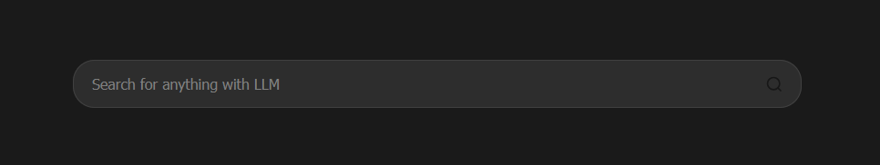
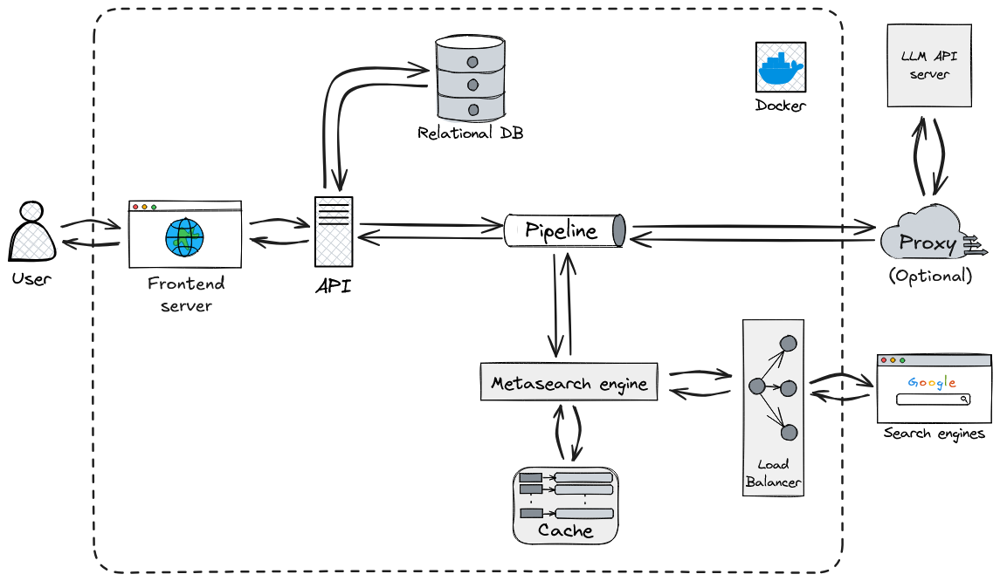

<p align="center">

</p>

# SearLLM

SearLLM is a backend application that conducts in-depth research on user queries by dynamically generating search terms, utilizing a private SearXNG instance to search the web, analyzing the results to identify knowledge gaps, and iteratively refining its searches until it can deliver a thoroughly supported answer with citations.

## Architecture overview

This application follows a hybrid multiservice architecture:

<p align="center">

</p>

- **Frontend Server**:
A project contains a simple web server powered by Express that handles interaction with the UI and uses a proxy endpoint to communicate with the API.

- **Modular Monolith**:
    The core of the application is a modular monolith, where related features are organized into modules within a single codebase and deployment unit. All the modules are ready for standalone deployment as they are communicating via a middleware RESTful API powered by FastAPI framework.
    The list of monolith modules includes:
    - **api** - a monolith core. Acts as a middleware FastAPI service which orchestrates all the other modules.
    - **agent** - a Langgraph powered agentic backend for question-answering.
    - **database** - an SQLAlchemy powered database access module managing anonymized requests and responses, and plain user data for token limit tracking.
    - **integrations** - the application currently supports and focuses on the telegram bot integration to provide messager users with this tool, there is also a handy little CLI tool.
    - **security** - a collection of security utilities used in the application.


- **Independent Services**:
    In addition to the modular monolith, the system includes four independent services. These services are configured, deployed, and scaled separately from the monolith. They communicate with the monolith and, if necessary, with each other via HTTP/HTTPS RESTful APIs.
    The list of independent services includes:
    - **A private SearXNG instance** - a powerful open-source metasearch engine which aggregates results from various search services and databases.
    - **Caddy** - a backward proxy for frontend, creates a LetsEncrypt certificate automatically.
    - **Redis\Valkey** - SearXNG dependency used for rate limiting and security measures.


## How the answer generation works

The core of the backend is a LangGraph agent defined in `backend/src/agent/graph.py`. It follows these steps:

<p align="center">

</p>

1.  **Generate Initial Queries:** Based on your input, it generates a set of initial search queries using an OpenAI GPT model.
2.  **Web Research:** For each query, it uses the Gemini model with a local instanse of SearXNG host to find relevant web pages.
3.  **Reflection & Knowledge Gap Analysis:** The agent analyzes the search results to determine if the information is sufficient or if there are knowledge gaps. It uses the same model for this reflection process.
4.  **Iterative Refinement:** If gaps are found or the information is insufficient, it generates follow-up queries and repeats the web research and reflection steps (up to a configured maximum number of loops).
5.  **Finalize Answer:** Once the research is deemed sufficient, the agent synthesizes the gathered information into a coherent answer, including citations from the web sources, using the same OpenAI GPT model.


## How to work with this API

To query the API directly via HTTP, you need to send a POST request on ```queries/query``` endpoint with a payload following this exact schema:
```yml
{
    "session_id": (str) intended to be a UUID
    "user_id": (int) unique user id
    "message": (str) full query text
}
```

For example:
```python
query = {
    "session_id": str(uuid.uuid4()),
    "user_id": 1234567890123,
    "message": "How many awards did Michael Jackson win throughout his entire carrer?",
}
```

Currently, the API provides JSON responses according to this exact schema:

```yml
{
    'message': (str) a full response text
    'highlight': (str) a short highlight of the full text
    'source_documents': (list of str) a list of links and references
    'session_id': (str) matches the query's session_id
    'input_tokens_used': (int) number of input tokens used by the query
    'output_tokens_used': (int) number of output tokens used by the query
}
```

## Getting started

Current version of the project is still in active development and is **not** intended to be run in production yet, although you can deploy the app locally in a few steps.

- Firstly, create a general env ```.env``` file and an ```.env``` file for both the frontend and the backend  (use ```.env.examle```) as a template;
- Add your Openrouter API key and base url to the backend ```.env```
- Add HTTP and HTTPS proxy urls (with inline auth) if you want to use a proxy
- Change standard agent parameters if needed
- Add any strong string of your choice as a SearXNG key in a general ```.env```
- Add any strong string of your choince as a SearLLM API token in both backend and frontend backend ```.env```. After you build the app, you will be able to generate a production-standard token via:
```sh
docker exec -it <"backend" container name> python ./tests/generate_token.py
```

After editing ```.env``` you can deploy the app locally via:
```sh
docker compose up --build
```

And test the the app using frontend UI at ```http://localhost:8888/```.

Moreover, you can test the API directly with:
```sh
docker exec -it <"backend" container name> python ./tests/test.py
```

An example of the API test output:

```javascript
{'message': 'Michael Jackson received a remarkable number of awards throughout '
            'his career. He was awarded 13 Grammy Awards, including '
            'prestigious honors such as the Grammy Legend Award and the Grammy '
            'Lifetime Achievement Award '
            '(https://en.wikipedia.org/wiki/List_of_awards_and_nominations_received_by_Michael_Jackson). '
            'In addition, he earned 6 Brit Awards and was honored with the '
            'Diamond Award at the 2006 World Music Awards for selling over 100 '
            'million albums, with his album "Thriller" alone surpassing 104 '
            'million copies sold worldwide '
            '(https://simple.wikipedia.org/wiki/List_of_awards_and_nominations_received_by_Michael_Jackson). '
            'Overall, Michael Jackson accumulated at least 90 wins and 82 '
            'nominations across various awards from multiple organizations '
            '(https://tylerturneymjhdp.weebly.com/achievementsawards.html; '
            'https://michael-jackson.fandom.com/wiki/List_of_awards_and_nominations_received_by_Michael_Jackson; '
            'https://www.imdb.com/name/nm0001391/awards/).',
 'highlight': 'Michael Jackson won at least 90 awards during his career, '
              'including 13 Grammys and 6 Brit Awards.',
 'source_documents': ['https://tylerturneymjhdp.weebly.com/achievementsawards.html',
                      'https://michael-jackson.fandom.com/wiki/List_of_awards_and_nominations_received_by_Michael_Jackson',
                      'https://simple.wikipedia.org/wiki/List_of_awards_and_nominations_received_by_Michael_Jackson',
                      'https://en.wikipedia.org/wiki/List_of_awards_and_nominations_received_by_Michael_Jackson',
                      'https://www.imdb.com/name/nm0001391/awards/'],
 'session_id': '38cf5463-baca-4cf4-bd27-694757def148',
 'input_tokens_used': 2874,
 'output_tokens_used': 511}
```

## Roadmap

As mentioned before, the project is still in active development. Currently, it is planned to implement these features:

- Telegram bot integration (WIP as of end of July 2025)
- Add a serious DB integration
- More complex user authorization